اگر که از کاربران لینوکسی باشین، شاید شنیدین که آرچ یه لینوکس خفن! ولی با نصبه سخته! (خب تا حدودی با سخت بودن نصب آرچ موافقم! ولی اگه ۲ ۳ بار نصب کنین، راحت یاد می‌گیرین!) خب، بخاطر سختی نصب آرچ و همچنین نصب دسکتاپ روش (و دلایلی دیگر ...) یسری آدم چند تا توزیع از آرچ مشتق گرفتن، مثل `[Manjaro](https://manjaro.github.io/)` یا [`Apricity OS`](https://apricityos.com/). هر توزیعی هم معایب و مزایایی داره! مثلا مانجارو ۲ ۳ تا نصب کننده مختلف داره یا اینکه دسکتاپ پیش‌فرضش، `KDE` عه! از اونورم، اپریسیتی مزایایی مثل خیـــــــلی سبک بودن داره (خیلی نزدیک به آرچه! البته به نظرم) و همچنین همونقدر که مانجارو برای طرفداران گنوم خوب نیست، اپریسیتی هم برای طرفداران کی‌دی‌ای خوب نیست. پس چون من گنوم رو خیلی دوست دارم و تونستم به یه شخصی‌سازی خوبی برسم (پست بعد بیشتر از گنوم می‌گم) اپریسیتی رو نصب کردم (ولی یه دلیل دیگش اینه که اینو تونستم راحت رو فلش نصب کنم با خودم ببرم اینور اونور)!

در ادامه مطلب، آموزش نصب اپریسیتی رو می‌بینین.

### پیش‌نیاز ها
بازم اول از همه یسری پیش‌نیاز داریم که می‌گم:
- یه فلش ۴ یا ۸ گیگ برای نصب کننده
- فایل [apricityos.iso](https://apricityos.com/)
- یه هارد یا فلش (اگه می‌خواین پرتابل کنینش) حداقل ۱۶گیگ
- بازم صبر!
- یه کامپیوتر با بوت بدون `UEFI`! (رو اون تست نکردم)

### ساخت فلش بوتیبل برای نصب
اول از همه باید یه فلش بوتیبل برای نصب بسازیم. برای این کار رو ویندوز از برنامه [rufus](./rufus-2.10.zip) استفاده می‌کنیم. اول برنامه رو دانلود و بعد اکسترکتش می‌کنیم، فایل اجراییشو اجرا می‌کنیم. به یه صفحه‌ای مثل صفحه زیر می‌رسیم که باید فلش رو از بخش `Device` و فایل apricity.iso که دانلود کردینو، از بخش `Create a bootable disk using` انتخاب کنین، بعد رو `Start` بزنین تا فلش رو بوتیبل کنه و نصاب (installer) رو رو فلش بریزه.
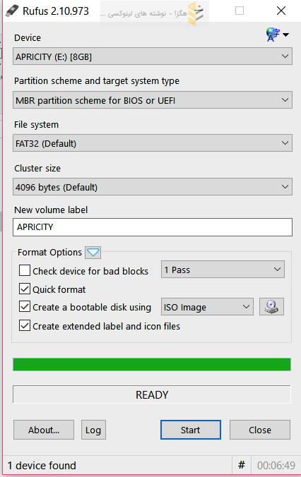

### نصب سیستم‌عامل
حالا می‌رسیم به نصب که خیلی راحته! اول باید فلشو بوت کنیم که بسته به کامپیوترتون فرق داره روشش، بعد معمولا باید گزینه اولو بزنین و صبر کنین تا بوت شه. بوت که شد، باید اینستالر رو اجرا کنین (معمولا خودش باز میشه). صفحه اول باید زبون رو انتخاب کنین که بزارین پیش‌فرضش بمونه اوکی عه. و برین مرحله بعد.
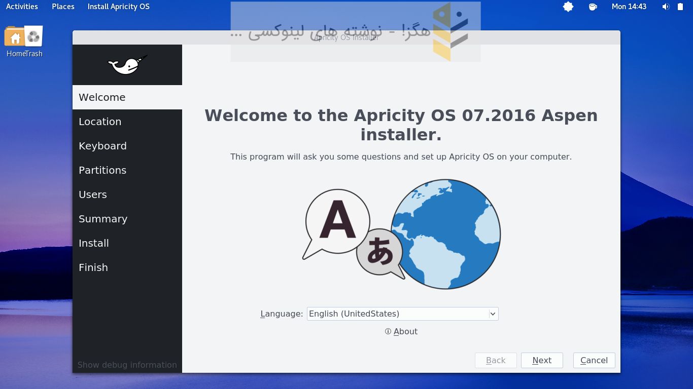

این مرحله منطقه زمانیتونو باید انتخاب کنین، مثلا من می‌زنم ایران.
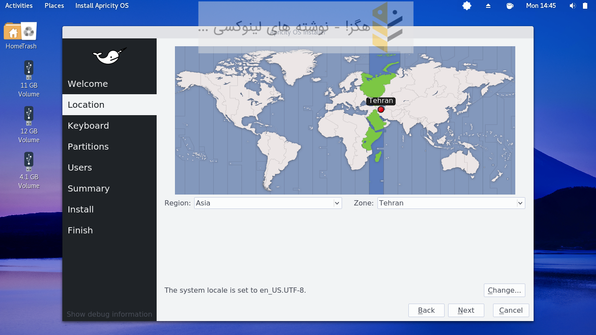

مرحله بعد تنظیمات کیبورده که می‌زاریم پیش‌فرضش بمونه.
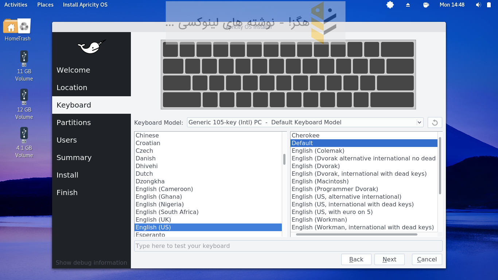

مرحله بعد که مهمترین مرحلس، مرحله پارتیشن بندیه. اینجا من خودم پارتیشن بندی می‌کنم پس گزینه `Manual Partitioning` رو انتخاب می‌کنم (همچنین از بالا جلوی `Select storage device` هارد یا فلشیو که قراره روش بنصبه رو انتخاب می‌کنم.
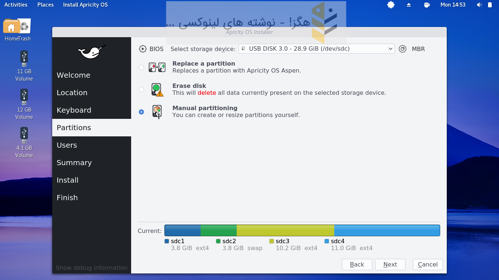

مرحله بعدی، باید پارتیشن هارو تعریف کنیم و بگیم که بوت‌لودر کجا نصب شه. 
اول از همه، یه پارتیشن برای بوت‌لودر می‌سازیم (فرمت: `EXT4`، مونت‌پوینت: `/boot`، حجم: حداقل ۲۰۰ مگابایت)
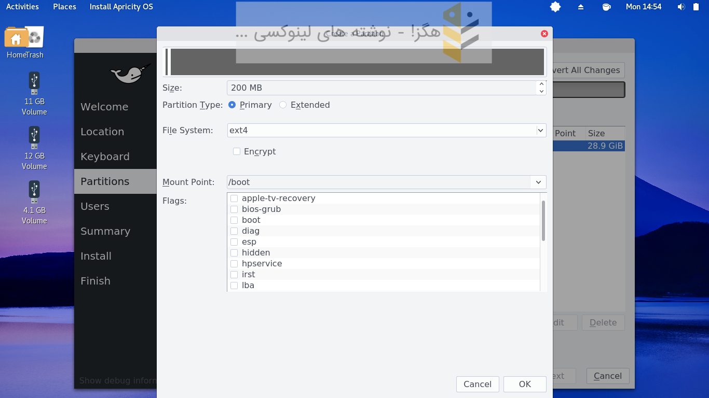

پارتیشن بعدی، سوآپ هست که می‌گن ۲برابر رم بسازین، ولی من خودم ۴گیگ میسازم
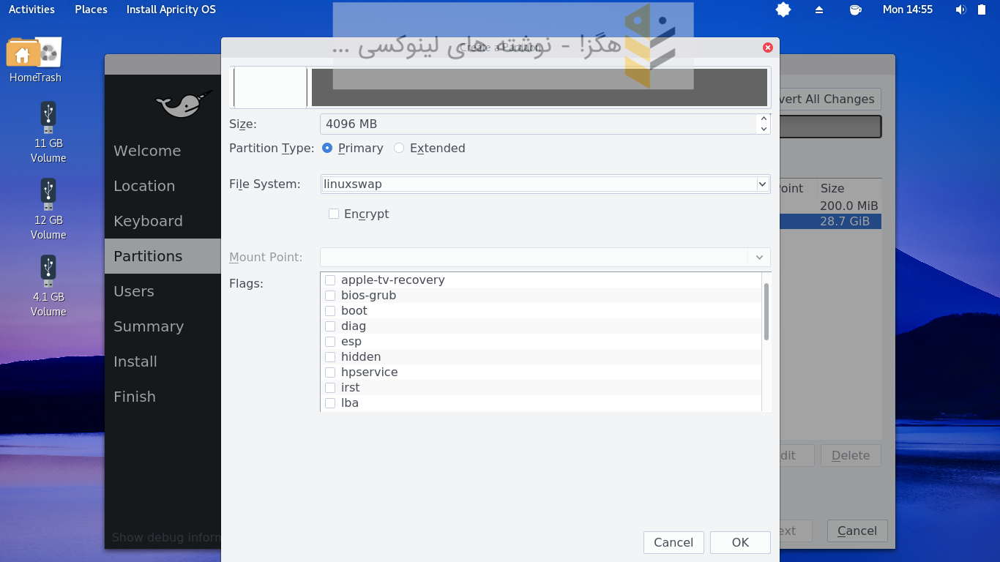

حالا برای بقیه ۲ حالت داریم، یا کل حافظه رو برای `root` بگیریم، یا اینکه برای `/home` یه پارتیشن جدا بسازیم، که من حالت ۱ رو انجام میدم.
آخر کارم، باید جلوی `Install boot loader on:` درایوی که گراب روش نصب باید بشه رو انتخاب کنیم.
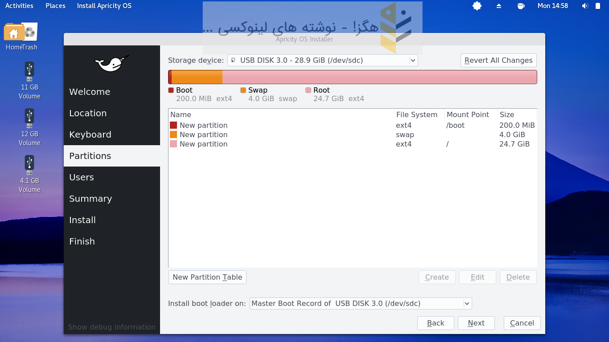

مرحله بعدی هم باید `username` و `hostname` و ... رو تعریف کنیم که مثلا من اینطوری کردم:
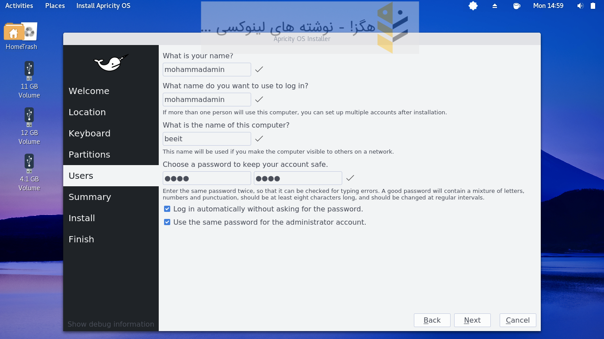

مرحله آخرم باید تایید کنید نصبو!
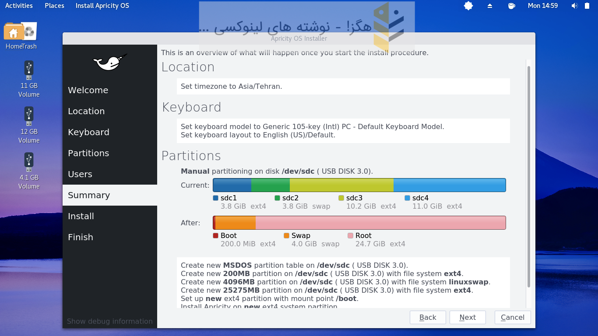

و در حال نصب ....!
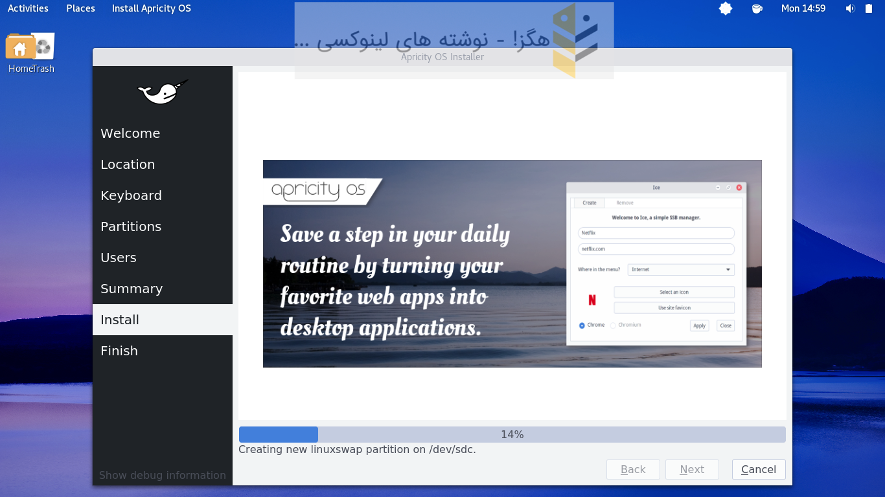

بعد از پایان نصب و بوت کردن سیستم، می‌تونین مثل [آموزش قبل](http://h4x.ir/3)، دسکتاپ خودتون رو کاستومایز کنین (تم و اینا بریزین)!
پـــــــــــایـــــــــــان